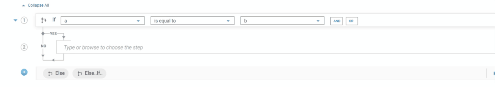
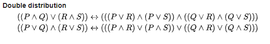

The condition builder is a simple interface for adding simple and complex conditions.

<FlowService>
  <FlowStep comment="Select left-operand by choosing a field" img="conditional-constructs/condition_builder_leftoperand.png"/>
  <FlowStep comment="Select a condition" img="conditional-constructs/condition_builder_condition.png"/>
  <FlowStep comment="Select right-operand" img="conditional-constructs/condition_builder_right_operand.png"/>
  <FlowStep comment="Add one new row with AND condition" img="conditional-constructs/condition_builder_and.png"/>
  <FlowStep comment="Add one new row with OR condition" img="conditional-constructs/condition_builder_or.png"/>
</FlowService>

## Select from one of the available conditions
* **is equal to** - checks whether value in left-operand is **equal** to right-operand 
* **is not equal to** - checks whether value in left-operand is **not equal** to right-operand
* **is greater than** - checks whether value in left-operand is **greater** than right-operand
* **is less than** - checks whether value in left-operand is **lesser** than right-operand
* **greater than or equal to** - checks whether value in left-operand is **greater than or equal to** right-operand
* **less than or equal to** - checks whether value in left-operand is **lesser than or equal to** than right-operand
* **is empty** - checks field selected value in left-operand is **empty**
* **is not empty** - checks field selected value in left-operand is **not empty**
* **is null** - checks whether field selected in left-operand is **null**
* **not null** - checks whether field selected in left-operand is **not null**
* **exists** - checks whether field selected in left-operand **defined**
* **not exists** - checks whether field selected in left-operand **is not defined**

## Example 1 - (a == b)

## Example 2 - (a == b && b == c)

## Example 3 - (a == b || b == c)

## Example 4 - How to build more complex conditions
 For example, lets take a more complex example: **(a == b && b == c) || (c == d && d == e)**
 * Add inputs from [I/O panel](/define-io/1_adding_fields): **a, b, c, d, e**
 * Add the rows as shown below

 * The current interface works by grouping all the conditions based on **OR** condition. 

## FAQs
* How to add conditions like: **(a == b || b == c) && (c == d)**  

**Sol)** This condition has to be converted to equaivalent expressions using the distributive property (Ref:https://en.wikipedia.org/wiki/Distributive_property) :

So, the equivalent expression would be: **(a == b && c == d) || (b == c && c == d)**