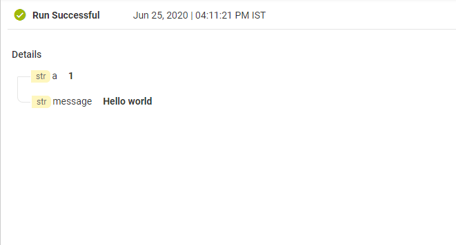
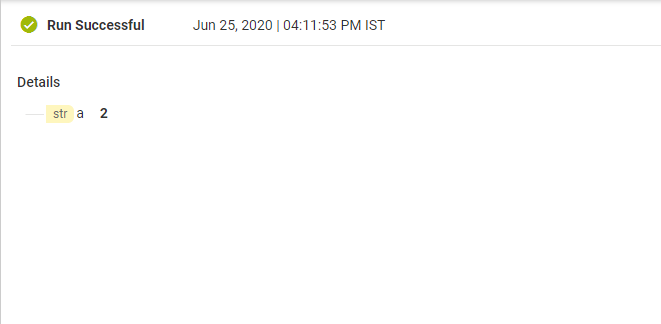
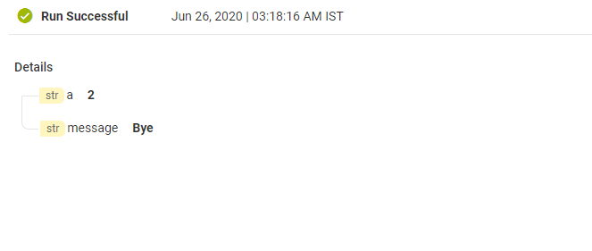

import ifElseJSON from '../assets/conditional-constructs/data/if_else_example.json'

## If step
`If` step is a conditional step which executes its children steps only if the condition evaluates to **true**.

## Else step
`Else` step is a conditional step which executes its children steps only if the condition in the previous step evaluates to **false**.
The previous step must be either a `If` step or `ElseIf` step.

## Example 1 - Print 'Hello world' if a equals 1
* Add an input **'a'** from [I/O](../assets/conditional-constructs/if_inputs.png)
* Add a `if` step and add condition **a equals 1**.
* Add a service **'LogCustomMessage'** and add mapping as shown below

* Save the FlowService.
* Run the FlowService with input for a = 1. Result: Step inside `If` step will be executed since condition in `If` step evaluates to **true**.

* Run the FlowService with input for a = 2. Result: Step inside `If` step will not be executed since condition in `If` step evaluates to **false**.

## Example 2 - Else print 'Bye' 
* Overview

<FlowService textToCopy={ifElseJSON}>
  <FlowStep comment="Print 'Hello World', if a == 1, else print 'Bye'" img="conditional-constructs/if_else.png"/>
</FlowService>

* Add an input **'a'** from [I/O](../assets/conditional-constructs/if_inputs.png)
* Add mapping as shown below

* Run the FlowService with input for a = 1. Result: Step inside `If` step will be executed and step inside `Else` will not be executed.
lse`.

* Run the FlowService with input for a = 2. Result: Step inside `If` step will not be executed but step inside `Else` will be executed.

