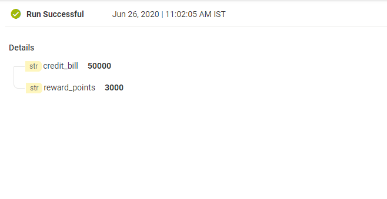
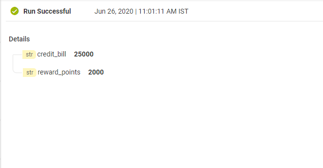
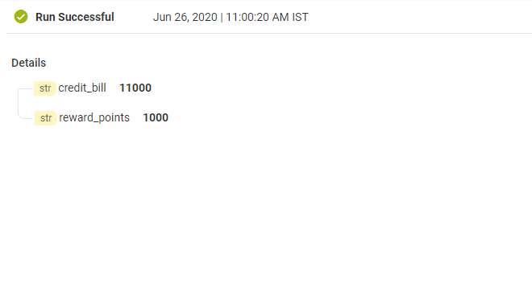
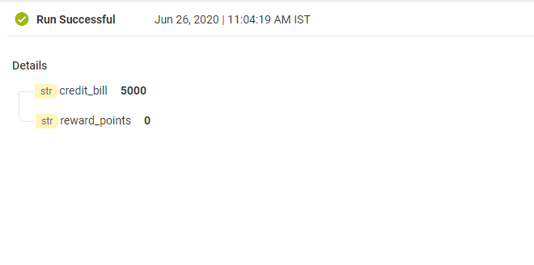

import elsifJSON from '../assets/conditional-constructs/data/switch_example.json'

`ElseIf` step is a combination of 'if' and 'else' step. It executes the children steps only if the conditional expression in the previous 'If/ElseIf' step evaluates to **false** and conditional expression in the current step 
evaluates to **true**.
The previous step must be either a `If` or `ElseIf` step.

## Example - Get reward points based on credit bill
  Lets write a FlowService that adds **'reward_points'** based on the amount of credit bill.  
  * If **credit bill** amount is greater than ***30,000***, the user will get **reward_points** as ***3000***. Let this be the max. number of reward_points that can be given to user.
  * If **credit bill** amount is ***20,000 to 30,000***, the user will get **reward_points** as ***2000***.
  * If **credit bill** amount is ***10,000 to 20,000***, the user will get **reward_points** as ***1000***.
  * If **credit bill** amount is less than ***10,000***, the **reward_points** would be ***0***.

<FlowService
title="Get reward points as per credit bill"
textToCopy={elsifJSON}>
  <FlowStep comment="" img="conditional-constructs/elseif_example.png"/>
</FlowService>

* Inputs from [I/O panel](/define-io/1_adding_fields).

* Results

