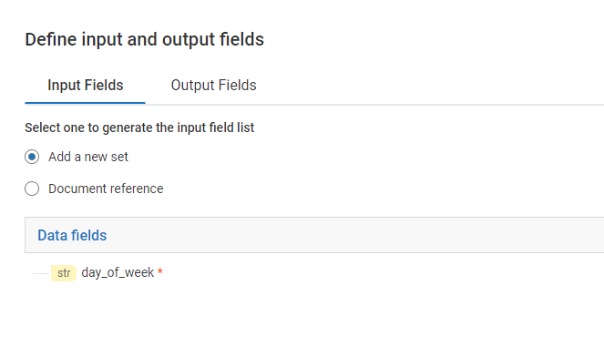

import switchJSON from '../assets/conditional-constructs/data/switch_example.json'

The `Switch` step contains one or many `Case` steps and executes only one of the `Case` steps based on the result of the expression in `Switch` step.
The `Case` step with only the matching value in the switch step gets evaluated, others are ignored. 

## Types of 'Case' step
There are mainly three kinds of `Case` steps:
* Case with **'custom'** value  
This step executes when the expression from the parent `Switch` step evaluates to the value contained inside this step.
* Case with **'$null'** value  
This step executes when the expression from the parent `Switch` step evaluates to **null**.
* Case with value **'$default'**  
This step executes when none of the value in other `Case` step matches with  the evaluated from parent `Switch` step.   
This step, if present **must be the last `Case` step** inside the `Switch` step.

## Example - Print 'Day of the week'

Lets write a FlowService which will print weekdays from 'Monday' to 'Friday' for inputs 1 to 5.  
If input is other than 1 to 5, lets print it as a 'Weekend'. 

* Add input from [I/O panel](/define-io/1_adding_fields)

* Add steps as shown

<FlowService
textToCopy={switchJSON}>
  <FlowStep comment="Print the day of the week for input values 1 to 5" img="conditional-constructs/switch_example.png"/>
</FlowService>

* Save and run to check the results