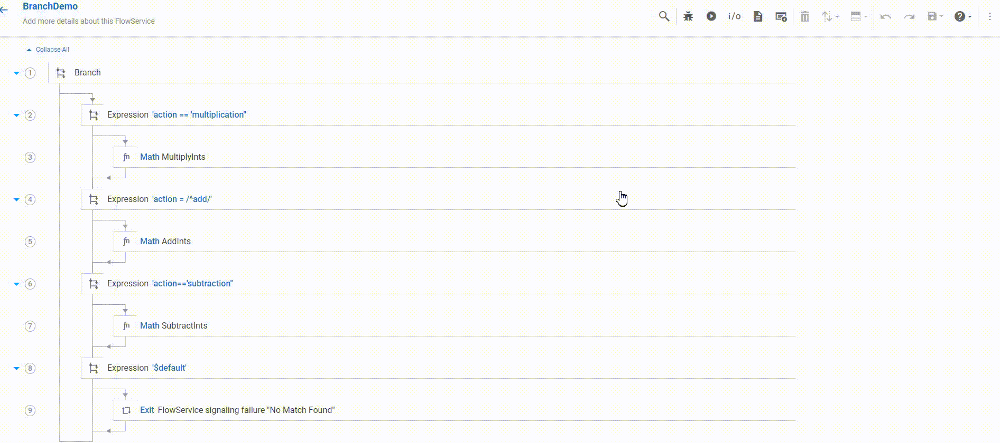

import branchJSON from '../assets/conditional-constructs/data/branch_example.json'

The `Branch` step contains one or many `Expression` steps and executes only one of the `Expression` step which is evaluated to true and comes sequentially first.
All the other `Expression` steps under branch are ignored. 

## Types of 'Expression' step
There are mainly two kinds of `Expression` steps:
* **'custom'** Expression  
This step executes when the condition/conditions given inside this step is evalated to true.
The conditions can be any of the options mentioned in the conditional builder, in addition, user can specify a **regex** as well.

* Expression with **'$default'**  
This step executes when none of the `Expression` steps are evaluated to true.   
This step, if present, can be anywhere in the sequence and is executed at the last.

## Example -  perform basic arithmetic operations based on user input

Lets write a FlowService which will perform arithmetic operations based on the action given by user.  
* `Expression 1`: If input is equal to 'multiplication', perform multiplication of two integers.
* `Expression 2`: If input starts with 'add', perform addition of two integers.
* `Expression 3`: If input is equal to 'subtraction', perform subtraction of two integers.
* `Expression $default`: If the input doesn't match with any of the above expressions, the exit with failure message 'No match Found'

Add input from [I/O panel](/define-io/1_adding_fields)  

  

* Add steps as shown

<FlowService
textToCopy={branchJSON}>
  <FlowStep comment="Conditional execution of arithmetic operations" img="conditional-constructs/branch-example.png"/>
</FlowService>

* Following is the demo of how the branch executes for a sample of inputs

