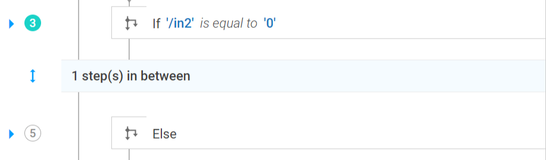

## What is a breakpoint ?

A breakpoint is a point where you want processing to pause when you debug the FlowService.
Breakpoints can help you isolate a section of code or examine data values at a particular point in the execution path.

## How to add/remove breakpoint ?

Adding and removing breakpoints are quite easy while debugging a FlowService .

For instance to add  a breakpoint, just click on  step number next to a step as shown below

In the example,step number 3 has a breakpoint (shown as highlighted green circle).

Similarly to a remove breakpoint you can click on that step number again and the breakpoint point will be removed.

## When can we add breakpoints ?

The breakpoints may be added either before debugging the FlowService or during the process of debugging.

## Default breakpoint

Even if the user has not added any breakpoint, the first step  is considered as default breakpoint.
So when you debug a FlowService, the execution is paused at the first step by default.

 **Note ** The breakpoints are retained until we close the FlowServices editor. When the FlowService is opened again, the breakpoints may have to be added again if required.
