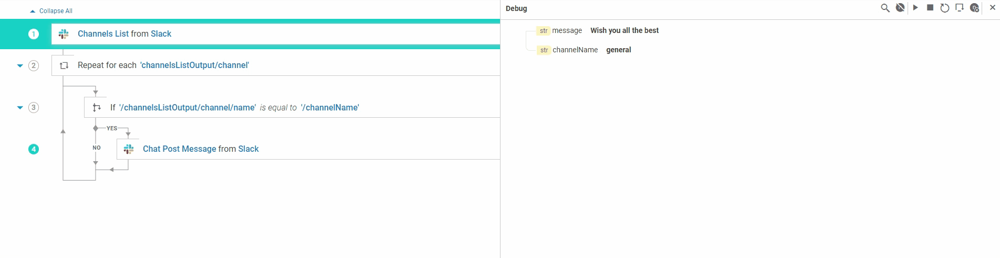

To start the **Debug** session,  click on the Debug icon in the toolbar or use the keyboard shortcut `CTRL + SHIFT + D`.

## Debug a FlowService 
When we have defined input for a FlowService, and try debugging it,
an **Input Values** dialog is popped up to supply input values for the input fields  defined in the FlowService.
We can then provide value for the respective input fields to get started with debugging.
For more information on configuring values check [Input Values](/run-flowservices/1_execute-flowservice#inputvaluesdialog) section.

If  no input is defined for a FlowService, then it directly opens the **Debug Panel**. As mentioned before, debug session pauses at the first step even if you have not inserted a breakpoint.

### Usecase

For a better understanding, lets debug a FlowService and understand the usage of debug controls.
In the example, we will debug a FlowService that posts a message to a Slack channel. 
The services takes the channel name and the message as inputs.
Its implemented as mentioned below.
- Get the channels from the Slack Account
- Iterate over the channels
- Compare it with user defined channelName ( we received as input)
- On successful match, post the user defined message on the respective channel

## Default Breakpoint
When we click on debug, by default the debug session pauses on the first step. The first step will be a default break point.
So even if the user hasn't added any breakpoint it pauses in this step as shown below.
User may add any breakpoints during the debug session as well.

## Step over
Step over enables the user to execute a FlowService on step by step basis. Here in this example, you may notice the break point getting repeated as we iterate the channels in the slack.
Please note the iteration number 

## Resume
Resume enables the user to pause the debug session of a FlowService on every next breakpoint. 
Here in this example, when the user selects resume, when the FlowService is paused on step 1.
The next break point is in step 4 ( this is inside IF and only if the condition is evaluated to true, the control comes here else its skipped).
So please note that control stops on step 4 on succesful match as shown below.

To know the keyboard shortcuts of the respective debug controls and for details on other controls, please  refer [Debug toolbar controls](/debug-flowservices/1_debug-toolbarr#debugtoolbarcontrols)