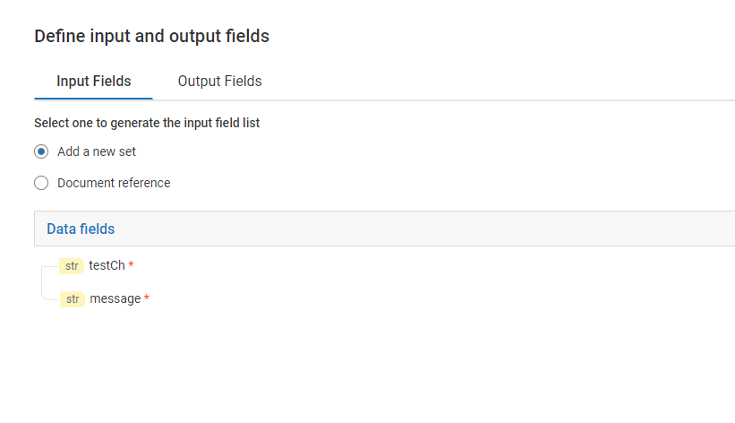

import repeatJSON from '../assets/loop-constructs/data/loop_array.json'

The repeat step iterates only on an array of any type and the number of executions is equal to the size of the array.

## Repeat
This control takes one input paramaeter:
* Input field

This controls takes only array as an input parameter.

## Example overview - Post message to 'Slack' channel

<FlowService
description="The above flow steps are used to find the channel for which the name is value in field 'testCh' and post a message to it"
textToCopy={repeatJSON}>
  <FlowStep comment="Get Channels list from slack" img="simple-flowservice/add-services/image-slice_01.png"/>
  <FlowStep comment="Repeat the following steps for  every channel" img="simple-flowservice/add-services/image-slice_02.png"/>
  <FlowStep comment="Check if channel name is equal to field 'testCh'" img="simple-flowservice/add-services/image-slice_03.png"/>
  <FlowStep comment="Post a message to that channel" img="simple-flowservice/add-services/image-slice_04.png"/>
  <FlowStep comment="Add more steps if needed" img="simple-flowservice/add-services/image-slice_05.png"/>
</FlowService>

## Example description - Post message to 'Slack' channel
1) Add two input fields as below from [I/O panel](/define-io/1_adding_fields):
* testCh - name of the channel where we are going to post the message
* message - the message we are going to post to slack

2) Add steps as shown below:
<FlowService>
  <FlowStep comment="Get Channels list from slack" img="simple-flowservice/add-services/image-slice_01.png"/>
  <FlowStep comment="Repeat the following steps for  every channel" img="simple-flowservice/add-services/image-slice_02.png"/>
  <FlowStep comment="Check if channel name is equal to field 'testCh'" img="simple-flowservice/add-services/image-slice_03.png"/>
  <FlowStep comment="Post a message to that channel" img="simple-flowservice/add-services/image-slice_04.png"/>
  <FlowStep comment="Add more steps if needed" img="simple-flowservice/add-services/image-slice_05.png"/>
</FlowService>

3) Add pipeline mapping in step 4 as shown below:

4) Save and run the FlowService. Provide input values as below:

5) Results

Check the slack channel in the slack account configured in step 4 of **FlowService example**. The slack channel should have a new posted message with as given in previous step.
