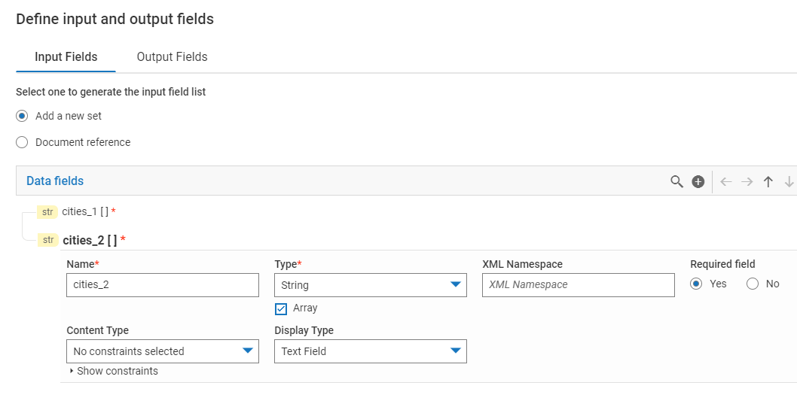
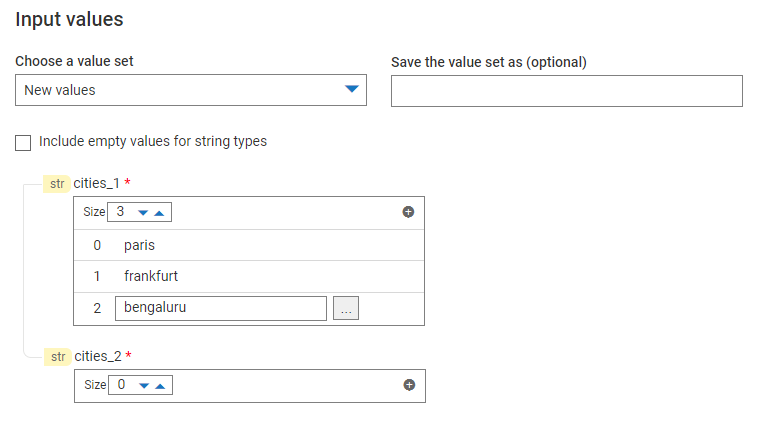
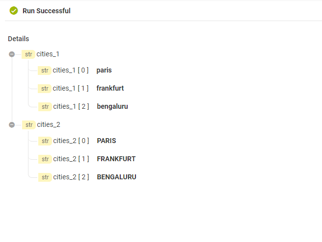

import repeatIOJSON from '../assets/loop-constructs/data/repeat_io.json'

The concept is same as `Repeat for each` except it has takes two parameters and it iterates over both the input field array and output field array together. 

## Repeat Input - Output

This control takes two parameters of type array:
* Input field
* Output field

## What happens when we have variable length arrays?

This control iterates on both the input and output field but the number of iterations depends on the size of input field array.  
The fields of the output field will be created if does not exist or will be overwritten if already exists.

Input field size | Output field size | Iteration count
 --- | --- | ---
5 | 5 | 5
5 | 0 | 5
0 | 5 | 0

## Example - How to transform city names to uppercase?

1) Add two string array fields in the [I/O panel](/define-io/1_adding_fields): **cities_1** and **cities_2**.  

2) Add a `Repeat Input - Output` control:
  * In the input field dropdown, select **cities_1**.  
  * In the output field dropdown, select **cities_2**.  

3) Add a service **toUpper** (String) under step `Repeat Input - Output`.  
4) Open pipeline and map **cities_1** to **inString** and **value** to **cities_2** as shown below.

5) [Run the FlowService](/run-flowservices/1_execute-flowservice) and provide a list of city names in **cities_1**. For example: 

6) Results:

