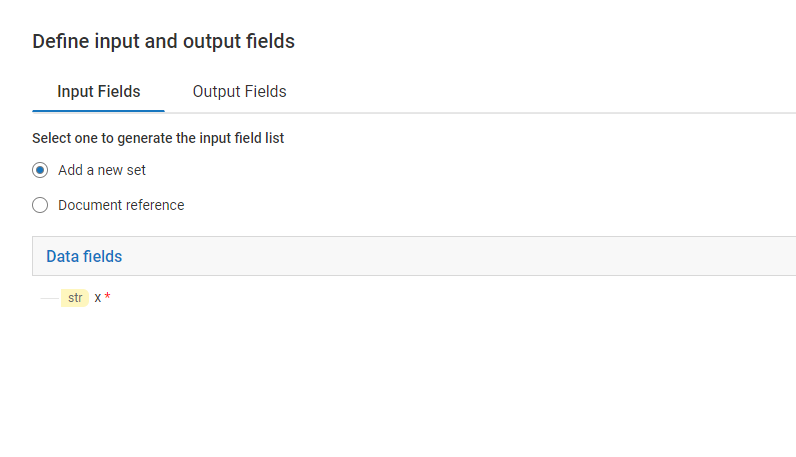

import dountilJSON from '../assets/loop-constructs/data/do_until.json'

A `Do..Until` loop keeps executing till the condition in the `Until` step is false. The statements inside the `Do` step will be executed at least once.

## How many times the steps inside 'Do' step has repeated?
**'$retries'** is an internal field which contains the number of times the steps inside `Do` have repeated.

## Example overview - Print 'Hello World' few number of times.
<FlowService
title="Print 'Hello world' a given number of times with Do..Until"
description="The above steps inside 'do' keeps appending '--Hello World--' till the value is greater than or equal to 5"
textToCopy={dountilJSON}>
  <FlowStep comment="" img="loop-constructs/do_until_1.png"/>
</FlowService>

## Example description - Print 'Hello World' few number of times.
1) Add inputs as shown below:

2) Add a `Do..Until` step and add condition in `Until` step as shown:

