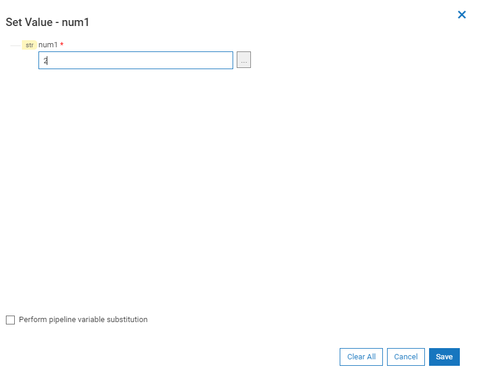

import flowSetValueJSON from '../assets/pipeline/setvalue/jsons/step-with-values.json'

In our example of addInts step, on opening the pipeline, we could see the service fields, _num1_ and _num2_.

# Set value

On clicking any one of these fields, you will be prompted to enter a value for that field.

<FlowService title = "Step with values set for the service variables."
description = "After setting value, the corresponding field is represented with 'setvalue' icon. If this step is exported, the set value of this field is also exported and can be used directly."
textToCopy={flowSetValueJSON}>
  <FlowStep comment="" img="pipeline/add-ints-step.png"/>
</FlowService>

# Behaviour of String on set value
The current behaviour of a field, of type string is as follows.

1. Accepts any non null value such as alphabets, numbers and symbols.
2. If opened the set value modal and didn't set any value, '' (empty value) is being set.

# Clear value
1. Already set values of a field can be reset to null/empty using this feature.
2. If the field is a document/ document reference, clear all will reset the nested fields as well.

The default values of different types on _set value_ (without giving any input, just opening set value modal and save) and _clear value_ are as follows:

Field Type | On Default Set Value | On Clear All
--- | --- | ---
String| _'' (empty)_ | _''_
Boolean | _false_ | _false_
Array | _[]_ | _[]_
Float, Int, Double, Long, Short | nothing set | _''_
Document, Document Reference | An object with all String fields at all levels are set to '', nothing set for other types | An object with all String fields at all levels are set to '', nothing set for other types

# PickList
If the field type is picklist, the options are being provided by the backend.
The behaviour of picklist changes based in the '*field_usereditable*'

Field Type | field_usereditable | On Default Set Value | On Clear All
--- | --- | --- | ---
PickList| _true_ |  ''   | ''
PickList | _false_ | *options[0]* |  *options[0]*

