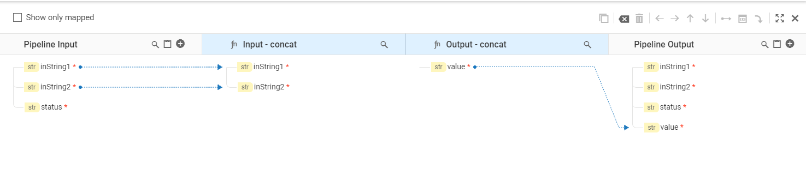
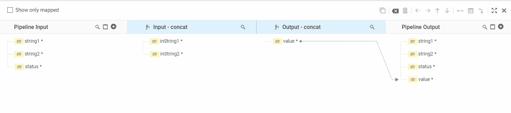

We can copy the value of a variable in one service to a variable in another service. This can be done through linking/mapping the variables.
Flow Service connects service and pipeline variables in the Pipeline view with a line called a link.
Creating a link/map between variables copies the value from one variable to another at run time.

# Implicit Map

Within a flow service, it implicitly links variables whose names are the same and whose data types are compatible.
FlowService connects implicitly linked variables with a dotted line.
Implicit links between pipeline and service variables

# Explicit Map
* ## Creating a Link Between Variables
    We can link input variables from the 'Pipeline In' column to a 'Service In' variables, and also we can link the output from a 'Service Out' to a different variable in 'Pipeline Out' column.

    **Note** : *Source Elements - Pipeline In and Service Out.
    Target Elements - Service In and Pipeline Out.*

    This can be achieved by 2 ways.

    * ## Drag and Drop
        We can drag mouse from source element and drop on the target element.
        
    * ## Link Button
        We can select a source element and target elemnt by clicking on it and then use link icon on top right on the mapping toolbar to link it.
        
