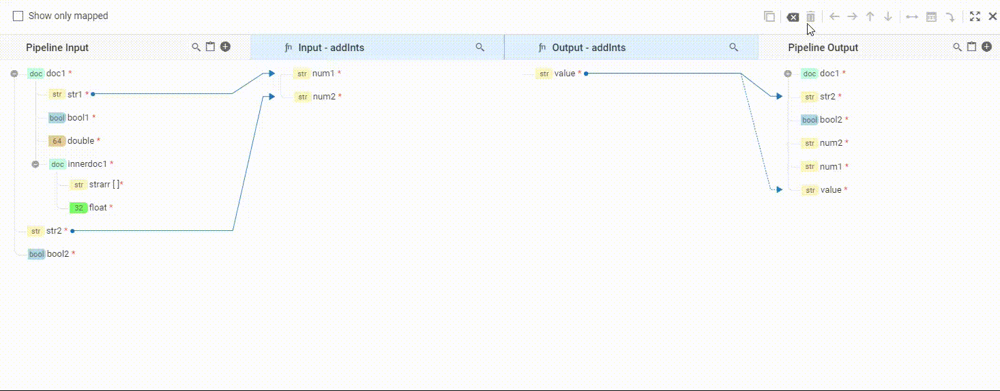
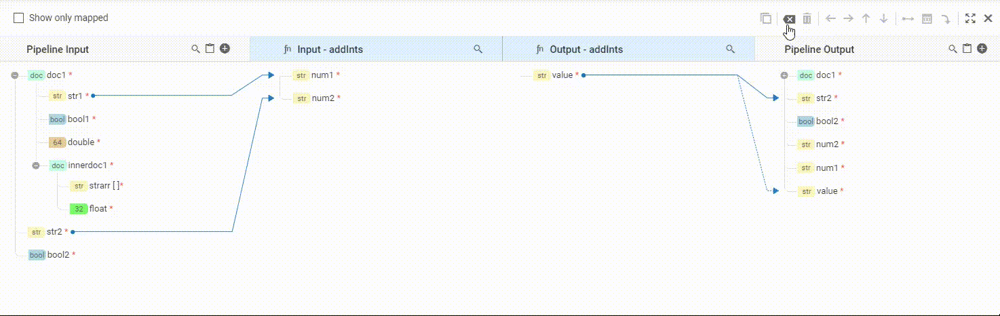

Manually done mappings can be deleted by the user when required.

## Remove each Mapping

#### a.Using Toolbar
An individual mapping can be deleted by selecting (hover on the map line/arrow and click) and then click the _delete_ icon in the toolbar.

#### b.Using Keyboard
An individual mapping can be deleted alternatively by selecting (hover on the map line/arrow and click) and then press the  **`del`** keyboard shortcut.

## Remove All Mappings
User can delete all the mappings existing at a time by clicking _clear all_ icon in the toolbar.

