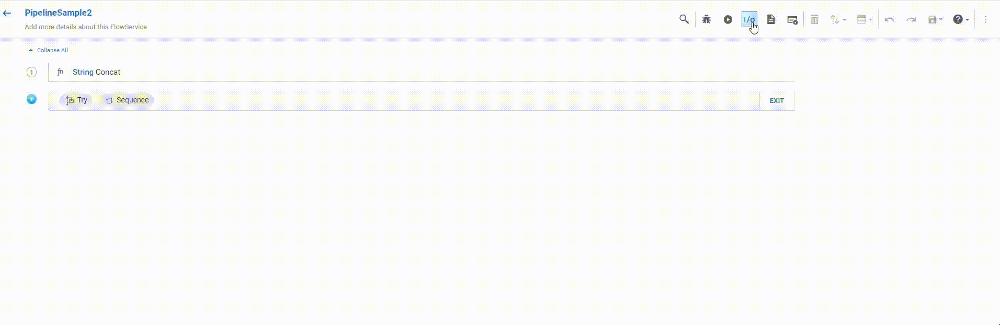

Any node can be be copied by selecting the node, clicking on the _copy_ icon or using `ctrl+c` shortcut and can be pasted using `ctrl+v` or the _paste_ icon in the pipeline panel header or define IO.
#### 1.Copy Nodes within the pipeline panel

#### 2.Copy and paste nodes between IO screen and Pipeline panel

#### 3.Copy across FlowServices

