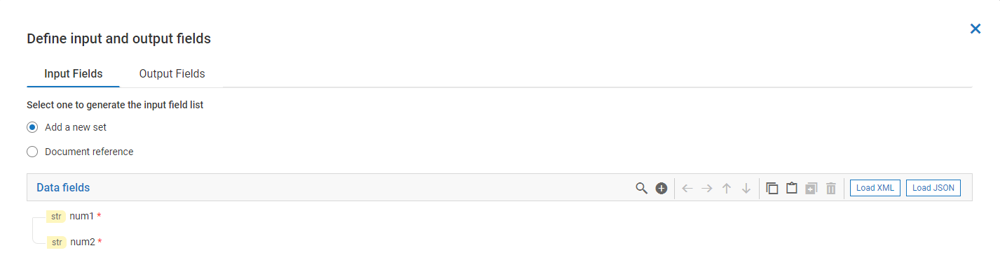
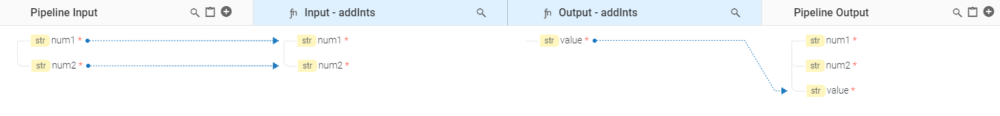
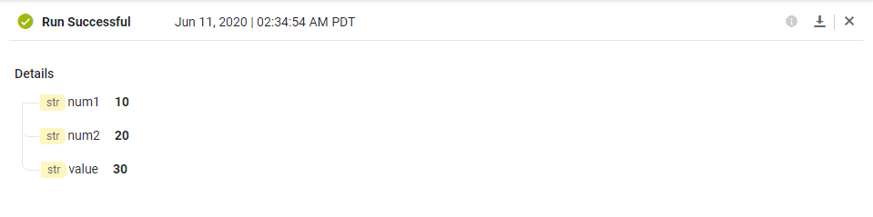

import flowJSON from '../assets/run-flowservices/execute-flowservice/flow.json'

To execute a FlowService we can either click on the run icon on the toolbar or use the key shortcut  `CTRL + SHIFT + R`

## Run a FlowService where Input is defined

When we have defined input fields for a FlowService, and try to run it, an **Input Values** dialog is popped up to supply input values for the input fields  defined in the FlowService.

Here lets take the example of FlowService **Add_Integers**,  which has defined two string input fields **num1** and **num2**

We have a step which invokes **addInts** from **Math** service

Since the field names are same as the fields in the service, they are auto-mapped

## Input Values Dialog

Now let's run the FlowService by clicking the run icon in Toolbar.
**Input Values** dialog is popped up to supply runtime values for the input fields defined by the FlowService.
Since we have defined two string fields, we may observe there are two text fields to supply value to the FlowService.
The str icon in left indicates the field is a string type. This icon represents the field type of the input field.

If no values is specified for a field, then it will inferred as null in IntegrationServer.
If the user has selected **Include empty values for string types** checkbox, and if  user does not specify any values for  *string field* in **Input Values** dialog, then it will be inferred as *empty string* in Integration Server.

If there is an array field type, then **Input Values** dialog displays a table with provision to add multiple array items.

There is a toggle button  next to every text field which helps user toggle between text area and text field. This may be useful when the user has a multi line text. It is applicable only for string input  fields.

If there is a need to run the FlowService multiple times, then it will be cumbersome to enter the values in these fields in
**Input Values** dialog. There is a way to save and re-use input values. This will be covered in detail in
[Using value sets](/run-flowservices/2_using-valuesets) section.

Click on **Run** button in dialog once the values are entered

## Results Panel

The FlowService execution results will be displayed in **Results Panel** as shown below

We can infer the following from the results panel
- Result Status - whether its successful or failure ?
- In case of failure, the details of the error
- The time when the FlowService got  executed
- The time will be represented in the timezone configured by the user in sagcloud.
- The actual results in a tree structure
- Clicking on close button(x) on the top right corner will close this panel

## Run a FlowService where Input is not defined

When the user executes a FlowService where input is not defined, then after clicking on run button in toolbar, the **Result Panel** is shown. We may not have the **Input Values Dialog** here.

<FlowService title="FlowService without any input fields"
description="GetCurrentDate is an  example to demonstrate FlowService where no  input fields are defined. It uses the Date Service to get current date"
textToCopy={flowJSON}>
  <FlowStep  img="run-flowservices/execute-flowservice/execute-flow-noinput-flow-01.png"/>
  <FlowStep comment="Get Date" img="run-flowservices/execute-flowservice/execute-flow-noinput-flow-02.png"/>
</FlowService>

