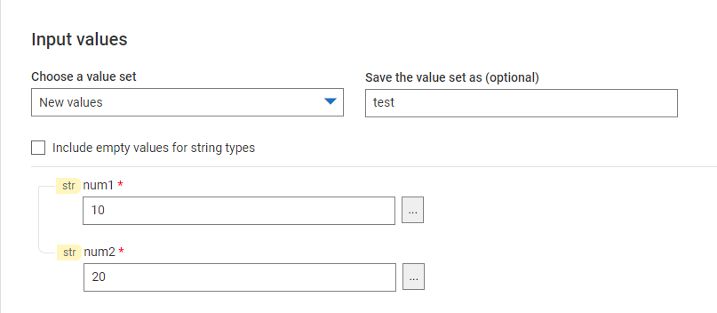
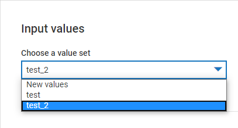
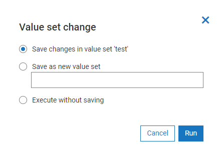

## What is a value set ?

Lets consider an usecase, where the input for a FlowService is a document with many fields in it. If  user intended to test this FlowService,
then every time he/she runs FlowService, there is an overhead for user to enter values for every field manually.

To address this overhead, we have introduced **value sets**. We can save input values supplied to a FlowService as a value set.
The next time when the user tries to run the flow, he/she can retrieve the input values from the value set and run the FlowService without any additional overhead.

Value sets are not restricted only for FlowServices with a complex input. Its applicable for all FlowServices.

And the same FlowService may have multiple valuesets saved with different sets of input values.

## How to add a value set ?

When the user wish to save the value set for the first time, he/she need to enter a desired name for the value set in **Save value set as** textbox on the top right corner.
Then user should click *Run** in **Input Values** dialog after entering the input values. The valueset will be saved.

User can save one more valueset with different input values for the same FlowService.

In the **Input Values** dialog select *New Values* and need to repeat the same procedure as above.
Alternatively user can choose an existing valueset and alter the required input values.
On click of Run, the below dialog is popped and user can either choose to update current valueset or create a new one.

## Retention period of a value set

The value sets are stored in the localstorage of the respective browser used by user. Hence until  the localstorage gets cleared, the value sets are retained by the FlowService editor.
Please check [local storage](https://developer.mozilla.org/en-US/docs/Web/API/Window/localStorage) to know more about it.

