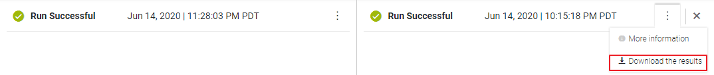

To view the execution results as JSON, there is an option in **Results panel**


 

 

A JSON file matching the FlowService name will be downloaded into your respective browser's download folder.

## Downloaded JSON File

```json
{
    "status": 0,
    "message": "Add_Integers executed successfully.",
    "pipeline": {
        "num1": "10",
        "num2": "20",
        "value": "30"
    },
    "correlationID": "5741b521-aecc-47e5-b25f-3ee97b0d69b2"
}
```
- **status** - 0 indicates Success & 1 indicates Failure
- **message** -  Success / Error message (if any)
- **pipeline** - Pipeline result values
- **correlationID** - Reference ID 
