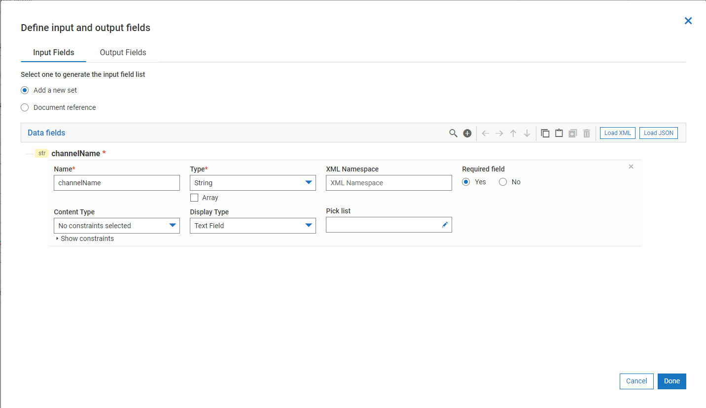

import flowJSON from '../assets/simple-flowservice/add-services/flow.json'

A FlowService mainly has 2 parts
- FlowSignature
- FlowService Steps

## FlowService Signature - Input  & Ouput

Like a service in any programming language, a user may define the input and output for a FlowService.
However its not binding that FlowService should always have i/o defined ( just like void main() in programming languages).
You may refer [Define IO](/define-io) section to check how to define I/O for FlowService.

## FlowService Steps

FlowService steps are the building blocks of a FlowService. The steps are shown as rectangular blocks prefixed with step numbers in the **FlowService Example** section below.
Steps may be compared to actual implementation of a service in a programming language, where the business logic or the algorithm is written.
Please check [Editor Usage](//editor-usage) section, to know the capabilities of a steps

### Pipeline Mapping

The pipeline in FlowService represents the input and output values on each step. This may be compared to the variables or the result on execution of every line in a program.
Every flow step which involves a connector / built-in service / another FlowService has the capability to map the pipeline.
The below picture shows a typical pipeline map. To know more about it, check [Pipeline Mapping](/pipeline-mapping) section.

## FlowService Example

<FlowService
title="Slack - Post message to channel"
description="The above flow steps are used to find the channel for which the name is testCh and post a message to it"
textToCopy={flowJSON}>
  <FlowStep comment="Get Channels list from slack" img="simple-flowservice/add-services/image-slice_01.png"/>
  <FlowStep comment="Repeat the following steps for  every channel" img="simple-flowservice/add-services/image-slice_02.png"/>
  <FlowStep comment="Check if channel name is testCh" img="simple-flowservice/add-services/image-slice_03.png"/>
  <FlowStep comment="Post a message to that channel" img="simple-flowservice/add-services/image-slice_04.png"/>
  <FlowStep comment="Add more steps if needed" img="simple-flowservice/add-services/image-slice_05.png"/>
</FlowService>
